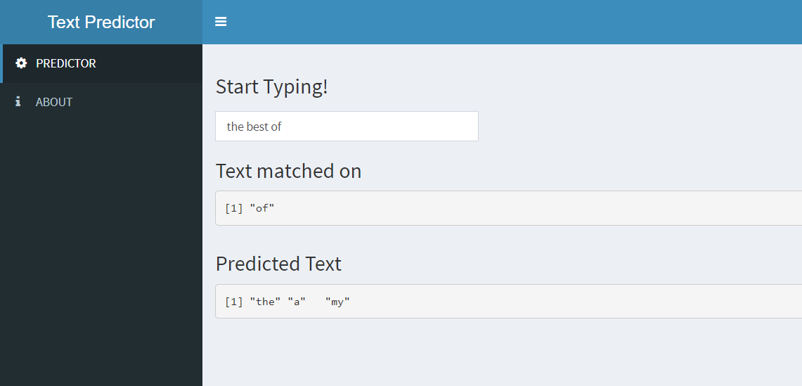

```{r setup, include=FALSE}
knitr::opts_chunk$set(echo = FALSE)
```

## Background
In many of today's applications natural language processing helps make out lives easier. Including voice recognition, to turing robots and autocorrect. This project focuses on developing an alogirthm for text prediction and implementing a solution.

### Objectives
- Analyse a corpora of data for to train an algorithm for text prediction
- Develop a shiny application to demonstrate the algorithm in practice
- Product this slide deck

## Data Sources
The corpus data used was from HC Corpora.
Only the English corpora was used as was compiled from twitter, news sites and blogs.

Profanity was filtered from the source data using the following list
https://raw.githubusercontent.com/LDNOOBW/List-of-Dirty-Naughty-Obscene-and-Otherwise-Bad-Words/master/en

To simplify the solution, all text was converted to lower case.


## Algorithm
A stupid back-off algorithm was implemented in my solution.
Ngrams of length two to six, were created. The ngrams were built after tokenization of the texts. Each token would then be ranked according to the maximum likely hood estimation (i.e. Frequency). Then the ngram would be pruned if:
- There was less than 4 occurances of the text phrase
- It was not in the top 3 occurances

Now with the ngrams setup. The algorithm would take the last six words and progressive check each ngram in descending size until it found a match.

## Usage

To use the [application](https://grandpotato.shinyapps.io/Text_Predicter/) simply enter the text and see the predictions below.

!!!NO MATCH!!! is displayed when no matches are found in the ngram

```{r, out.width = "600px"}

```


